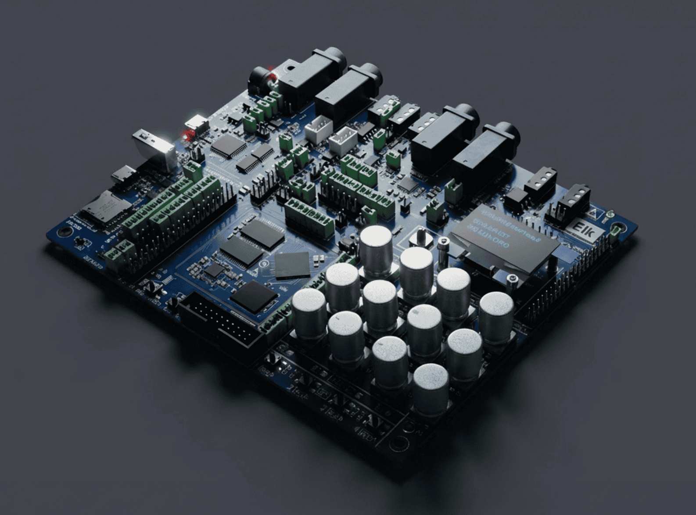

# Elk Stomp development kit

<p align="center"></p>

Welcome to Elk Stomp, a production-ready platform for embedded audio applications based on the STM32MP1 SoC.

## Overview

The kit is meant to develop applications for the "Elk Stomp SoM", which comes soldered on the Elk Stomp development board (aka as the carrier board).

The **SoM** runs Elk Audio OS, a dedicated Linux distribution for low-latency audio applications. It comes with the following audio-specific software components:

- **RASPA**: Elk's proprietary real-time audio front-end (think "Elk's coreaudio" if you're used to Mac, even though the api is actually mimicking Jack API);
- **Sushi**: Elk's headless DAW, a multi-track, multi-channel audio engine with the ability to host VST2, VST3 and LV2 plugins (plus a proprietary format);
- **Sensei**: a gRPC server that acts as a middleman between the hardware controllers on the board (pots, encoders, switches, ...) and user space applications.

The **Stomp development board** - apart from hosting the SoM - provides:

- **hardware controllers**: 8 pots, 4 clickable encoders, 4 switches, 1 multi-position switch;
- **LEDs**: 4 red leds, 4 RGB leds;
- **OLED display**: monochrome screen;
- **audio codec**: together with audio jacks, it provides audio input and output to the SoM.

The goal here is to provide a prototyping platform that can fit most musical applications.

In general, **developing an application** for Elk Stomp boils down to 2 main steps:

- write some **DSP** code in the form of an VST or LV2 plugin that you will host in **Sushi**;
- write a "**glue**" app that implements the rest of your business logic and maps UI events emitted by Sensei (aka User inputs) to audio plugin parameters.

To facilitate this, Elk provides a development environment for **desktop**. The goal is to allow the dev to primarily work on their own machine while making the transition to the board as frictionless as possible.

## Getting Started

The first thing to do is to get some sound, you can decide if you'd like to get running on desktop first, or go straight to the board:

- [Get running on Desktop](#running-on-desktop)
- [Get running on the Board](#running-on-the-board)

## Running on Desktop

On the desktop, the 3-component SoM system as outlined above is obviously different: 

- you are locked to your OS audio frontend (coreaudio or pulseaudio) and 
- you don't have hardware controllers, let alone Sensei to interact with them.

Therefore Elk provides the following:

- a binary build of **Sushi for desktop** (in `bin/`);
- binary builds of many **extra plugins**;
- a **mock Sensei** server: a local Python gRPC server with a Qt GUI that mimics the UI you find on the dev board and that serves the same API as on the dev board;
- Furthermore, you also get **Guru**: Elk's Python library to help write a "glue" app.

### Setting up the desktop env

#### Python

Real-time audio might feel like an application space not obviously suited for Python. Nevertheless Elk encourages its use on Stomp for 2 reasons:
- prototyping/development speed is very high;
- if properly confined to "glue" functionality, no Python code is ever involved in real-time audio processing.

That being said, running Python apps can be a hassle. It's usually recommended to use virtual environments instead of installing dependencies globally. For that purpose, we promote the use of `uv`, a convenient way to manage virtual envs per project. So, make sure you have `uv` installed on your machine. Installation instructions can be found [here](https://github.com/astral-sh/uv).

Once `uv` is installed, running a Python script is a simple `uv run my_script.py`.

#### MacOS

On Mac you should run the following command at the top-level of this repo to ensure that all binaries and plugins have permission to run:

```bash
sudo xattr -rc .
```

#### Windows

On Windows you will also need the Git Bash shell to run example scripts: <https://git-scm.com/install/windows>

In addition, due to the number of audio APIs available on Windows you may need to change the default audio input and output devices used by Sushi (more info about Sushi below). If you're not getting audio when running the examples you can get Sushi to output all available audio devices by running:

```bash
bin/win/sushi.exe --portaudio --dump-audio-devices
```

Then choose the input and output devices corresponding to the audio driver and/or audio API you would like to use. If you're uncertain we recommend using WASAPI. Then you can modify `bin/run-examples.sh` to pass these parameters to sushi, for example:

```bash
bin/win/sushi.exe --portaudio --audio-output-device=2 --audio-input-device=3
```


### Checkhealth: run an example

To confirm that your environment is ready let's try and run one of the included examples: **ex1**.

#### The easy way

In the root directory:

```bash
uv run bin/run-example.sh examples/ex1/
```

This will start all the components required for ex1.

The same command can be run with the paths to the other example folders `ex2` and `ex3`.

`CTRL-C` to quit.

You should see the mock UI and hear a guitar loop with distortion. You can interact with the UI and hear its effect. With ex1, pots 1 thru 3 control Drive, Tone and Level respectively (see ex1/param_mappings.py).

#### Optional: Sushi GUI

```bash
uv run modules/sushi-gui/sushi-gui.py
```

## Running on the board 
We tried to make moving away from the desktop onto the Stomp hardware as easy as possible. The vision is that porting the prototype that you made on the desktop to the actual hardware is as simple as copying a couple of files to it.

At this point in time, there are still a few extra steps that you need to go through:
- Because they are dependent on your desktop audio devices, config files for Sushi must be adapted to use the ones available on Stomp;
- At a later stage, you will probably want to build your own VSTs for Stomp. Refer to the included `BUILDING.md` to learn how to do that. Elk also provides AI skills and agents to assist you with it;

On top of that, you should probably make sure you have enough familiarity with Linux, the terminal and serial connection.

Let's start with the basics: connecting to the board, logging in and copying files to it.

### Powering on

Stomp dev requires a center negative 9v DC power supply (aka a guitar pedal PSU) capable of delivering up to 1.5A. Allow ~30 sec for the dev board to properly start, though the serial connection can even be made before or during startup to view boot messages.

### Serial connection
During development, you will probably want to use SSH to connect to the board (click link for instructions) but at this early stage, we recommend you use a **direct** serial connection via packages like picocom or minicom (we’ll use picocom in this document). For basic usage, like running an application and setting up Linux, plain serial is all you need. Furthermore, setting up SSH will require an IP and figuring it out will be a breeze if you can connect to the board directly.

You will need:

- A USB cable with suitable connectors (the board side is USB-C)
- A program that can be used for serial port communication, on Linux/Mac we recommend picocom which is available on most package repositories for Linux, as well as on Brew for MacOS. On Windows we recommend PuTTY.

First plug the USB-C cable into the port labelled “USB TO UART”. Once plugged in, you need to find the name of the serial device:
#### Mac/Linux

Run `ls /dev/ttyUSB*` (Linux) or `ls /dev/tty.usbserial-*` (Mac) to get a list of connected USB serial ports. The board connects 4 ports, each with the same label but with increasing indices. The lowest of these indices is the one you want!

To connect, run `picocom -b 115200 /dev/ttyXXXX` (replace ttyXXXX with the port you found in the previous step)

You will be presented with a serial prompt:
user = `mind`
password = `elk`

#### Windows

To find the name of the connected serial ports you can open the Device Manager via the search bar, then expand the "Ports (COM & LPT)" section to see all COM ports. There may be several ports listed here with names like “COM3”, “COM4”, etc. and you may need to try a few of them to find the one corresponding to the board.

Open PuTTY and in the connection settings choose Serial and enter a port name from the Device Manager (for example “COM1”), set the “Speed (baud rate)” to 115200, then click “Open”. If the board is powered on and the connection is successful you’ll then either see a stream of boot messages if the board is booting, or else a login prompt. If nothing is shown then you can try a different port (for example “COM2”).


### Run an example to confirm
The board comes with a few examples of typical applications, all located in the home folder.

Run:
```bash
./bin/run-example.sh examples/ex1
```

After some startup time, you should be able to hear sound coming from the headphone output. `Ctrl-C` will stop it.

> NOTE:
> This run-example.sh script is a simple convenience that is actually more useful on your desktop because it also starts various other tools (see further down). But on the stomp-dev board it does something that you should probably be aware of: it makes sure that Guru is properly added to the environment.

### Setting up SSH
SSH is the preferred way to connect to the board during development. You can connect either via a USB wifi adapter, or a USB wired ethernet connector.

#### Wired ethernet
Use a USB-C dongle with Ethernet. Plug it into the USB-C port that is **not** labelled “USB TO UART”.


#### Wifi
Currently the only supported WiFi adapters are ones that use the 88x2bu driver, however if you have another WiFi adapter that you need to support you should be able to either compile the kernel module in our cross-compiling SDK, or else reach out and we’ll be happy to help. A list of supported WiFi adapters can be found [here](https://github.com/morrownr/88x2bu-20210702?tab=readme-ov-file#compatible-devices).

Plug the wifi adapter into the USB port on the board. Once it’s plugged in you’ll need to connect it to your wifi network. Using the serial connection and logging in as the `root`` user (no password), use `connmanctl` to discover and connect wifi devices:

```bash
sudo connmanctl
```

#### Connecting over SSH
```bash
ssh mind@board_ip_here
```
The password is `elk`.

#### Transferring files to the board

Use `scp`:
```bash
scp your_file mind@board_ip:
```

The board also has `rsync` installed by default.

### Adapting the desktop prototype for the board
Let's remind ourselves the key components:
- a Sushi config file;
- a glue app.

> Mock Sensei is obviously not needed on Stomp.

#### Sushi config
There might be 2 areas where modifications are required:
- **audio connections**: on Stomp, you have 4 engine channels (inputs = guitar inputs L&R and stereo line in, outputs: guitar outputs L&R and stereo headphones out). Depending on your desktop configuration, you might have to adapt certain connections. As a matter of fact, you might have noticed that the examples come with 2 config files for Sushi. One is for desktop, the other for Stomp.
- **plugin paths**: until now, all our examples have been using builtin plugins, aka plugins that come with Sushi and have uids like `sushi.testing.gain`. But if you were developing your own plugin - let's say a VST3 plugin called `My_plug.vst3`, you will have to: build it for Stomp (see documentation) -> copy it somewhere on the Stomp board (more on that later as well) -> make sure your Sushi config points to that same location. That is what the `path` attribute is for.

#### Glue app
In principle, a glue app written in Python (with our Guru library) does not need any changes. (Apart from `grpcio` which is already installed on the Stomp, it has only pure Python dependencies from the standard library). 

But Stomp **does not come with `uv`**. Add to this that at the time of writing, `guru` is not installed globally but is instead simply **bundled** in `modules/guru/` and running your application become a bit less straight forward...

You are free to attack this issue any way you see fit but one obvious solution can be found in the included `run-example.sh` script where it reads:  

```bash
export PYTHONPATH=$PYTHONPATH:$(pwd)
```
Which adds the working directory to the PYTHONPATH environment variable.

## Next steps

Now that you are set up with the Elk Stomp dev kit, here is what you could do:

- Follow along a [hands-on tutorial](TUTORIAL.md) built on the included examples
- [Build your own VST](BUILDING.md) for the Elk Stomp
- Read through the full [Elk Audio OS documentation](https://elk-audio.github.io/elk-docs/)
- Check out the [video introduction to the Elk Stomp](https://www.youtube.com/playlist?list=PLguMMYWVe-zlOdT7YtLIg8Sc8RzGmugbM)
